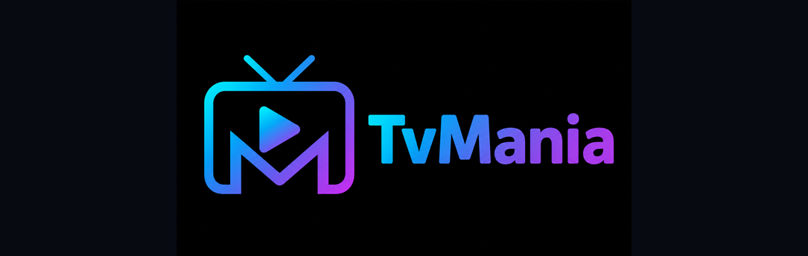

<div align="center">

  
  <br />
  <br />

  [![Contributors][contributors-shield]][contributors-url]
  [![Forks][forks-shield]][forks-url]
  [![Stargazers][stars-shield]][stars-url]
  [![Issues][issues-shield]][issues-url]
  [![License][license-shield]][license-url]

  <p>
    TvMania — an Android TV streaming player with M3U, Stalker and Xtream support.
    <br />
    IPTV playlists • EPG • Favorites • Android TV optimized
  </p>

</div>

## About

TvMania is a modern streaming player designed specifically for Android TV.

It supports M3U playlists, Stalker portals and Xtream Codes portals, with persistent playlists, EPG programme information and global channel favorites. It can also integrate with the Stremio addon ecosystem for content discovery and source resolution through user-installed extensions.

TvMania retains all media-player features and capabilities supported by the original NuvioTV project, while extending it with a complete IPTV experience.

Built with Kotlin and optimized for a TV-first viewing experience.

## Installation

### Android TV

Download the latest APK from [GitHub Actions](https://github.com/Aress777/IPTV-Streaming-TvMania/actions) and install it on your Android TV device.

## Development

### Prerequisites

- Android Studio (latest version)
- JDK 11+
- Android SDK (API 29+)
- Gradle 8.0+

### Setup

```bash
git clone https://github.com/Aress777/IPTV-Streaming-TvMania.git
cd IPTV-Streaming-TvMania
```

### Release Build

```bash
./gradlew :app:assembleFullRelease
```

### Running on Emulator or Device

```bash
# Release build
./gradlew :app:assembleFullRelease

# Run on connected device
adb shell am start -n com.nuvio.tv/com.nuvio.tv.MainActivity
```

## Legal & DMCA

TvMania functions solely as a client-side interface for browsing metadata and playing media provided by user-installed extensions and/or user-provided sources. It is intended for content the user owns or is otherwise authorized to access.

TvMania is not affiliated with any third-party extensions or content providers. It does not host, store, or distribute any media content.

See the repository license for usage terms.

## Built With

* Kotlin
* Jetpack Compose & TV Material3
* ExoPlayer / Media3
* Hilt (Dependency Injection)
* Retrofit (Networking)
* Gradle

## Star History

<a href="https://www.star-history.com/#Aress777/IPTV-Streaming-TvMania&type=date&legend=top-left">
 <picture>
   <source media="(prefers-color-scheme: dark)" srcset="https://api.star-history.com/svg?repos=Aress777/IPTV-Streaming-TvMania&type=date&theme=dark&legend=top-left" />
   <source media="(prefers-color-scheme: light)" srcset="https://api.star-history.com/svg?repos=Aress777/IPTV-Streaming-TvMania&type=date&legend=top-left" />
   
 </picture>
</a>

<!-- MARKDOWN LINKS & IMAGES -->
[contributors-shield]: https://img.shields.io/github/contributors/Aress777/IPTV-Streaming-TvMania.svg?style=for-the-badge
[contributors-url]: https://github.com/Aress777/IPTV-Streaming-TvMania/graphs/contributors
[forks-shield]: https://img.shields.io/github/forks/Aress777/IPTV-Streaming-TvMania.svg?style=for-the-badge
[forks-url]: https://github.com/Aress777/IPTV-Streaming-TvMania/network/members
[stars-shield]: https://img.shields.io/github/stars/Aress777/IPTV-Streaming-TvMania.svg?style=for-the-badge
[stars-url]: https://github.com/Aress777/IPTV-Streaming-TvMania/stargazers
[issues-shield]: https://img.shields.io/github/issues/Aress777/IPTV-Streaming-TvMania.svg?style=for-the-badge
[issues-url]: https://github.com/Aress777/IPTV-Streaming-TvMania/issues
[license-shield]: https://img.shields.io/github/license/Aress777/IPTV-Streaming-TvMania.svg?style=for-the-badge
[license-url]: http://www.gnu.org/licenses/gpl-3.0.en.html
